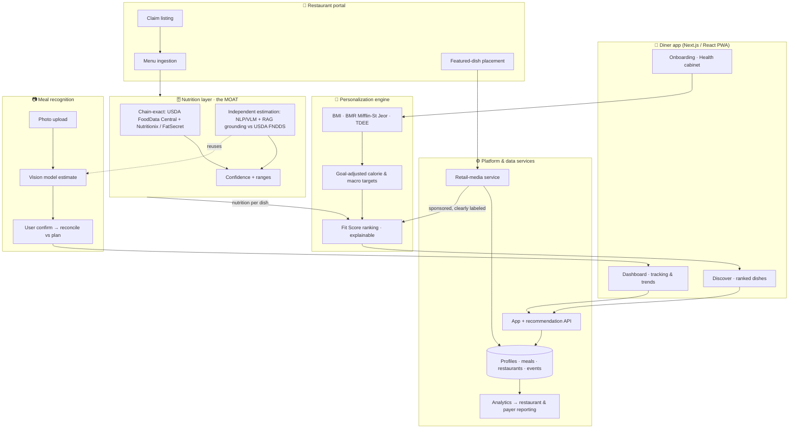

# Forkcast — System Architecture

How the product works end to end, what's built today, and how it scales. The defensible core is the **nutrition layer** — chain-exact data plus an estimation engine for the independent restaurants no commercial database covers.

---

## 1. System diagram

---

## 2. Components

### 2.1 Diner app
Next.js (App Router) + React + Tailwind, PWA-ready. Onboarding (health cabinet), discovery (goal-ranked restaurants/dishes), restaurant/menu pages with per-dish Fit Scores, and a tracking dashboard with photo logging and trends. *Implemented in this repo.*

### 2.2 Personalization engine
Pure, auditable functions (`lib/nutrition.ts`):
- **BMI** = kg / m²; standard WHO categories.
- **BMR** = Mifflin-St Jeor (most accurate widely-used predictive equation).
- **TDEE** = BMR × activity factor (1.2–1.9).
- **Targets** = TDEE ± goal delta (−500 lose / +300 gain), floored at safe minimums; protein 1.6–2.0 g/kg (ISSN), fat ~27% kcal, carbs remainder, fiber 14 g/1000 kcal.
- **Fit Score (0–100)** = weighted sum of calorie-fit (asymmetric Gaussian), protein density, fiber, sodium, sugar — weights shift by goal; returns human-readable reasons/warnings. *Implemented.*

### 2.3 Nutrition layer — the moat
Two paths to a nutrition profile for any menu item:
1. **Chain-exact lookup** — branded/chain items via USDA FoodData Central (free) + Nutritionix / FatSecret (licensed). Covers 20+-location chains the FDA already forces to disclose.
2. **Independent estimation** — for the structurally-unserved independents: an NLP/VLM pipeline that decomposes a dish from its **name + description + photo** into components and portions, then **RAG-grounds** the estimate against USDA FNDDS. Grounded decomposition cut MAE **63–83%** vs. ungrounded VLMs in published work (DietAI24, 2025). Every estimate carries a **confidence and range** — surfaced in the UI, never sold as clinical.

*Today's demo uses realistic seeded nutrition + a swappable AI seam (`lib/ai.ts`, `app/api/analyze/route.ts`); production swaps in the two paths above behind the same interface.*

### 2.4 Meal recognition
Photo → multimodal model (Claude Opus 4.8 vision for hard/mixed plates; a cheaper tier for routine logs) constrained to a structured nutrition schema → user confirm/correct → reconcile against the day's plan and weekly trend. The estimation engine (2.3) and this share the same vision/grounding stack.

### 2.5 Restaurant portal (two-sided)
Claim a listing, upload/paste a menu (auto-nutrition via the nutrition layer), and opt into clearly-labeled featured placement. Drives the retail-media revenue leg and the independent-restaurant coverage that is the moat.

### 2.6 Platform & data
App + recommendation API, retail-media service (sponsored ranking, always separated from organic Fit ranking), analytics feeding restaurant and payer/employer reporting, and the data store (profiles, meals, restaurants, events).

---

## 3. Recommendation flow (request path)

1. User opens Discover → app sends location + the user's daily targets (and what's already logged today).
2. Recommendation API pulls nearby restaurants and their menu items (nutrition from the nutrition layer).
3. For each dish, compute Fit Score against *remaining* budget and goal.
4. Rank; blend in clearly-labeled sponsored/featured dishes; return.
5. User adds a dish → plan updates → next request is informed by the new remaining budget.

---

## 4. Data sources

| Source | Use | Cost |
|---|---|---|
| **USDA FoodData Central / FNDDS** | Ground-truth foods + RAG grounding | Free |
| **Nutritionix / FatSecret** | Branded + chain restaurant items | Licensed (tiered) |
| **Edamam / Spoonacular** | Recipe/ingredient fallback | Licensed |
| **Multimodal LLM (Claude)** | Photo + menu-text estimation | Per-call (~$0.003–0.015/photo by tier) |
| **First-party** | Restaurant-supplied menus, user corrections | Owned — compounding data asset |

The flywheel: user corrections + restaurant-supplied menus continuously improve the independent-estimation model — data competitors can't buy.

---

## 5. Accuracy & honesty (design principle)

Photo calorie estimation has a **physics-bound error floor (~16–25%)**; portion size drives ~60% of error; single-photo LLMs run 36–40% MAPE on energy. Forkcast therefore:
- leads with **menu name + description** (where models match nutritionists),
- **RAG-grounds** every estimate in USDA data,
- **surfaces ranges and confidence**, and
- markets **"fast, good-enough, easy to correct"** — never clinical accuracy.

Honest positioning is also a moat: over-claiming (e.g. uncited "90% accuracy") invites backlash.

---

## 6. Tech stack

| Layer | Choice | Why |
|---|---|---|
| Frontend | Next.js 15 + React 19 + Tailwind v4 | Fast, deployable (Vercel/Netlify), PWA-ready, looks like the delivery apps |
| Charts | Recharts | Lightweight trend visualizations |
| State (demo) | React context + localStorage | Zero-backend interactive demo |
| AI | Claude (Anthropic) multimodal | Vision + structured output; tier-routed for cost |
| Nutrition data | USDA FDC + Nutritionix/FatSecret | Chain-exact baseline |
| Backend (prod) | API + Postgres + object storage | Profiles, meals, menus, events |

---

## 7. Build roadmap

| Stage | Scope |
|---|---|
| **Now (demo)** | Full interactive app: onboarding, Fit Score, discovery, dashboard, AI photo-log seam, restaurant pages |
| **MVP (0–6 mo)** | Real backend + auth; chain-exact nutrition (USDA + Nutritionix); live Claude photo analysis; Boston restaurant seeding |
| **v1 (6–12 mo)** | Independent-restaurant estimation engine (RAG-grounded); restaurant portal; featured-dish placement |
| **Scale (12 mo+)** | Retail-media service; analytics/reporting; payer/employer B2B2C integration; multi-metro |

---

## 8. Swapping the demo's mocked AI for real Claude

The demo is architected with a single integration seam:
- `lib/ai.ts` — `USE_REAL_AI` flag; when true, `analyzeMealPhoto` POSTs the image to `/api/analyze`.
- `app/api/analyze/route.ts` — returns a mock today; contains the full, accurate Claude Opus 4.8 **vision + structured-output** implementation (commented). Install `@anthropic-ai/sdk`, set `ANTHROPIC_API_KEY`, uncomment, flip the flag — no other code changes.

---

*Companion: `BUSINESS_PLAN.md` and `FINANCIAL_MODEL.md`.*
